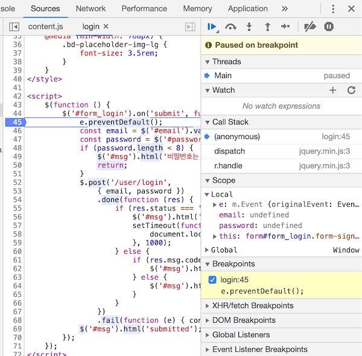

# DeBug

* `breakpoint` : 중단지점입니다. 실행 모드가 아닌 디버그 모드에서 프로그램을 중지하게 되는 지점의 표시입니다.
보통 개발도구에서 소스 라인 맨 앞 여백을 더블클릭하면 생깁니다. 다시 더블클릭하면 없어집니다. resume을 실행하면 다음 중단점을 만날 때까지 실행됩니다.
* `step over` : 한줄을 실행합니다. 함수가 있어도 실행 후 다음으로 넘어갑니다.
* `step into` : 함수 내부로 들어갑니다.
* `step out` : 함수를 끝까지 실행시키고 호출시킨 곳으로 되돌아 갑니다.
* `resume` : 디버그로 한 줄 한 줄 실행시키는 트레이스 모드를 그만두고 다음 브레이크포인트를 만날 때까지 실행합니다.
* `hot swap` : 디버깅 중의 메모리의 값을 변경해서 시뮬레이션하는 방법입니다.

## debugging mode

