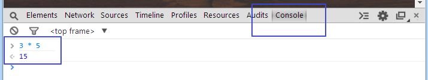

# JavaScript

* 1995 Brendon Eich

## 시작하기
* 브라우저에서 실행 가능
* `<script>` 태그 사이에 위치
* 개발 도구 콘솔(Console)
* 요소 검사(inspect element) > Console 탭
* 3 * 5 JS Console



## JSON
* JavaScript Object Notation
* 1999 Douglas Crockford
* Standard ECMA-262 3rd Edition—December 1999
* http://www.json.org/

## Object
* 객체
* {key: value, key2: value}
* 중괄호 {}
* key: value 쌍을 쉼표(, comma)로 연결

## Array
* 배열
* [value, value]
* 대괄호 []
* value를 쉼표(, comma)로 연결

## 문법
* 대소문자 구분
* 문장은 세미콜론(;)으로 구분
* 변수는 var로 선언
* var 없이 선언된 변수는 글로벌 변수

## 값 Value
* 숫자 : 정수, 실수
* 문자 : "" 또는 ''로 감싼 문자열(string)
* 불리언 : true, false
* null
* object
* array

## 변수 Variable
* 값을 담고 있는 문자열
* var 변수명 = 값;
* 변수명은 a-zA-Z0-9_의 조합
* 변수의 type은 가변

## 문장 Statement
* 명령어
* 문장은 세미콜론(;)으로 구분

## 식 Expression
* 변수에 값을 할당
* 연산자를 이용해 값을 산출

## 함수 function
* 명령어의 그룹
* 함수 선언 : function 함수명(파라미터) {명령문;}
* 함수 호출 : 함수명()

## 익명 함수 Anonymous function
* 이름 없는 함수
* 파라미터로 전달되는 함수
* 비동기 프로그래밍에서 CallBack 함수로 사용
* 익명 함수 선언 : function (파라미터) {명령문;}
* 익명 함수 호출 : (function(){})();

## DOM 스크립트
* DOM; Document Object Model
* HTML document를 제어하는 스크립트

```
<!DOCTYPE html>
<html>
<body>
    <div id="box"></div>
    <script>
        var box = document.getElementById("box");
        box.innerHTML = new Date();
    </script>
</body>
</html>
```

## related
* [Promise](/mib/js/promise)


## ref
* JS the right way
  * http://jstherightway.org/
* w3schools
  * http://www.w3schools.com/js/
* JS expressions and operators
  * https://developer.mozilla.org/en-US/docs/Web/JavaScript/Guide/Expressions_and_Operators
