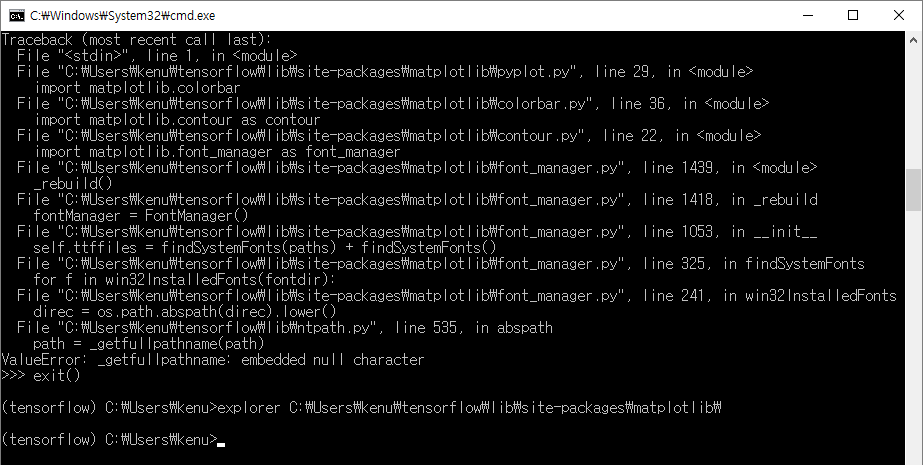
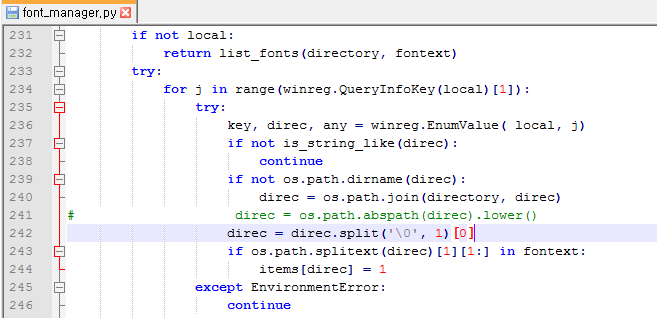
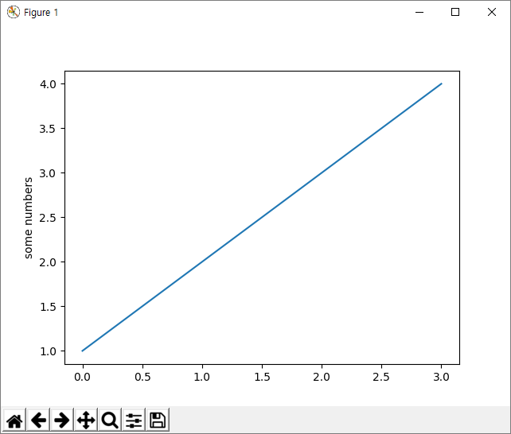

# matplotlib for windows
* http://matplotlib.org/
* `pip install matplotlib`
* `import matplotlib.pyplot as plt`

## Tutorials
* http://matplotlib.org/users/pyplot_tutorial.html

### error
* `ValueError: _getfullpathname: embedded null character`  


### fix
* open file font_manager.py  


* comment out and insert code
* `direc = direc.split('\0', 1)[0]`

### test
```
import matplotlib.pyplot as plt
plt.plot([1,2,3,4])
plt.ylabel('some numbers')
plt.show()
```
* check image  


## ref
* troubleshooting
  * http://stackoverflow.com/questions/34004063/error-on-import-matplotlib-pyplot-on-anaconda3-for-windows-10-home-64-bit-pc
* http://matplotlib.org/users/pyplot_tutorial.html
