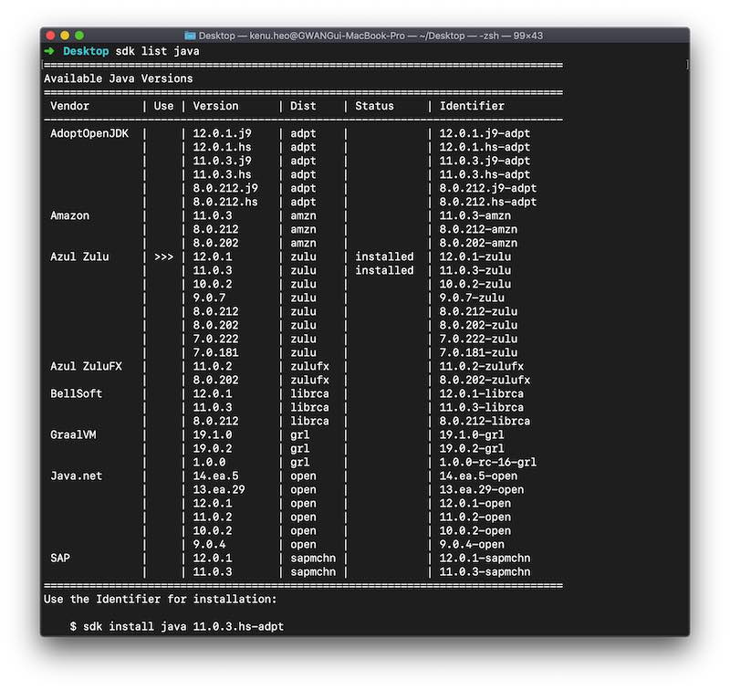

# SDKMAN
* http://sdkman.io/
* open bash shell
* `curl -s "https://get.sdkman.io" | bash`
* restart bash shell
* `sdk install springboot`
* `sdk help`
* Windows need Cygwin or Git Bash

## version
* `sdk install springboot 1.5.6.RELEASE`
* `sdk default springboot 1.5.8.RELEASE`
* `sdk list java`

