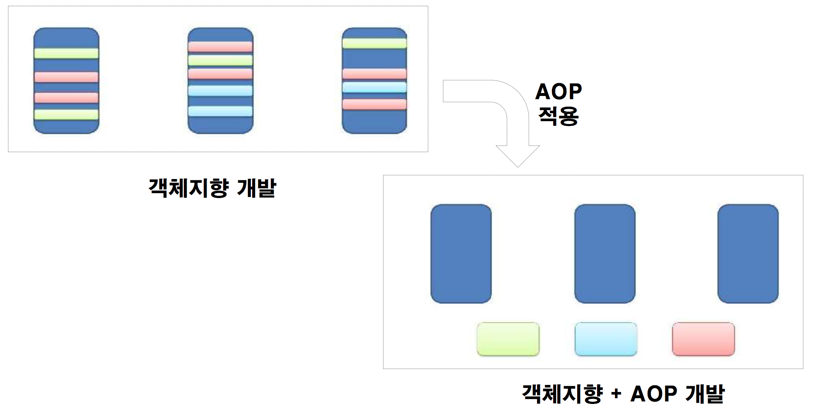
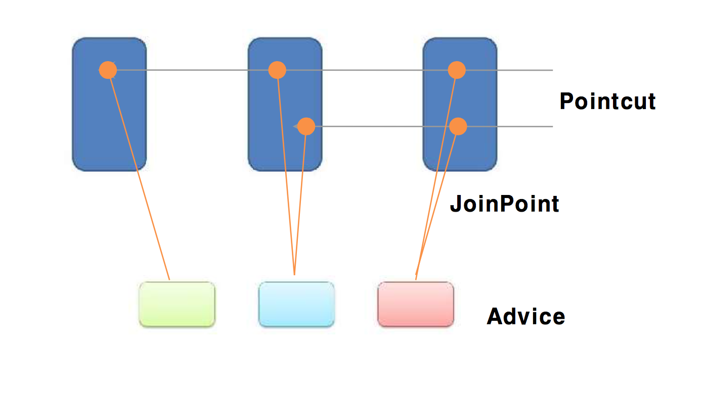

# Spring AOP
* Aspect Oriented Programming

## Concept
* Scattered duplicated code
* Devide Concerns


* Weaving


## Terms
* JoinPoint
  * Crosscutting Concerns 모듈이 삽입되어 동작할 수 있는 실행 가능한 특정 위치
  * 메소드 호출, 메소드 실행 자체, 클래스 초기화, 객체 생성 시점 등
* Pointcut
  * Pointcut은 어떤 클래스의 어느 JoinPoint를 사용할 것인지를 결정하는 선택 기능
  * 가장 일반적인 Pointcut은 ‘특정 클래스에 있는 모든 메소드 호출’로 구성
* 애스펙트(Aspect)
  * Advice와 Pointcut의 조합
  * 어플리케이션이 가지고 있어야 할 로직과 그것을 실행해야 하는 지점을 정의한 것
* Advice
  * Advice는 관점(Aspect)의 실제 구현체로 결합점에 삽입되어 동작할 수 있는 코드
  * Advice 는 결합점(JoinPoint)과 결합하여 동작하는 시점에 따라 before advice, after advice, around advice 타입으로 구분
  * 특정 JoinPoint에 실행하는 코드
* Weaving
  * Pointcut에 의해서 결정된 JoinPoint에 지정된 Advice를 삽입하는 과정
  * Weaving은 AOP가 기존의 Core Concerns 모듈의 코드에 전혀 영향을 주지 않으면서 필요한 Crosscutting Concerns 기능을 추가할 수 있게 해 주는 핵심적인 처리 과정

## Simple Example
* pom.xml

```xml
		<dependency>
			<groupId>org.springframework</groupId>
			<artifactId>spring-context</artifactId>
			<version>3.2.18.RELEASE</version>
		</dependency>
		<dependency>
			<groupId>org.springframework</groupId>
			<artifactId>spring-aop</artifactId>
			<version>3.2.18.RELEASE</version>
		</dependency>

		<dependency>
			<groupId>org.aspectj</groupId>
			<artifactId>aspectjrt</artifactId>
			<version>1.8.10</version>
		</dependency>
		<dependency>
			<groupId>org.aspectj</groupId>
			<artifactId>aspectjweaver</artifactId>
			<version>1.8.10</version>
		</dependency>
```

* Beans.xml

```xml
<?xml version = "1.0" encoding = "UTF-8"?>
<beans xmlns="http://www.springframework.org/schema/beans"
	xmlns:xsi="http://www.w3.org/2001/XMLSchema-instance" xmlns:aop="http://www.springframework.org/schema/aop"
	xsi:schemaLocation="http://www.springframework.org/schema/beans
   http://www.springframework.org/beans/spring-beans-3.2.xsd
   http://www.springframework.org/schema/aop
   http://www.springframework.org/aop/spring-aop-3.2.xsd ">

  <aop:config>
		<aop:aspect id="log" ref="logging">
			<aop:pointcut id="selectAll"
				expression="execution(* com.okdevtv.spring.aop.*.*(..))" />

			<aop:before pointcut-ref="selectAll" method="beforeAdvice" />
			<aop:after pointcut-ref="selectAll" method="afterAdvice" />
			<aop:after-returning pointcut-ref="selectAll"
				returning="retVal" method="afterReturningAdvice" />

			<aop:after-throwing pointcut-ref="selectAll"
				throwing="ex" method="AfterThrowingAdvice" />
		</aop:aspect>
	</aop:config>

	<!-- Definition for student bean -->
	<bean id="student" class="com.okdevtv.spring.aop.Student">
		<property name="name" value="Zara" />
		<property name="age" value="11" />
	</bean>

	<!-- Definition for logging aspect -->
	<bean id="logging" class="com.okdevtv.spring.aop.Logging" />

</beans>
```

* Student.java

```java
package com.okdevtv.spring.aop;

public class Student {
	private Integer age;
	private String name;

	public void setAge(Integer age) {
		this.age = age;
	}

	public Integer getAge() {
		System.out.println("Age : " + age);
		return age;
	}

	public void setName(String name) {
		this.name = name;
	}

	public String getName() {
		System.out.println("Name : " + name);
		return name;
	}

	public void printThrowException() {
		System.out.println("Exception raised");
		throw new IllegalArgumentException();
	}
}
```

* MainApp.java

```java
package com.okdevtv.spring.aop;

import org.springframework.context.ApplicationContext;
import org.springframework.context.support.ClassPathXmlApplicationContext;

public class MainApp {
   public static void main(String[] args) {
      ApplicationContext context = new ClassPathXmlApplicationContext("Beans.xml");

      Student student = (Student) context.getBean("student");
      student.getName();
      student.getAge();
      student.printThrowException();
   }
}
```

* Logging.java

```java
package com.okdevtv.spring.aop;

public class Logging {
	/**
	 * This is the method which I would like to execute before a selected method
	 * execution.
	 */
	public void beforeAdvice() {
		System.out.println("Going to setup student profile.");
	}

	/**
	 * This is the method which I would like to execute after a selected method
	 * execution.
	 */
	public void afterAdvice() {
		System.out.println("Student profile has been setup.");
	}

	/**
	 * This is the method which I would like to execute when any method returns.
	 */
	public void afterReturningAdvice(Object retVal) {
		System.out.println("Returning:" + retVal.toString());
	}

	/**
	 * This is the method which I would like to execute if there is an exception
	 * raised.
	 */
	public void AfterThrowingAdvice(IllegalArgumentException ex) {
		System.out.println("There has been an exception: " + ex.toString());
	}
}
```

* Detailed Weaving

```xml
<aop:config>
  <aop:aspect id="log" ref="logging">
    <aop:pointcut id="selectAll"
      expression="execution(* com.okdevtv.spring.aop.Student.getName(..))" />
    <aop:before pointcut-ref="selectAll" method="beforeAdvice" />
    <aop:after pointcut-ref="selectAll" method="afterAdvice" />
  </aop:aspect>
</aop:config>
```


## ref
* Spring AOP Tutorial with Example 2017
  * https://www.dineshonjava.com/spring-aop-tutorial-with-example-aspect-advice-pointcut-joinpoint/
* AOP with spring
  * https://www.tutorialspoint.com/spring/aop_with_spring.htm
