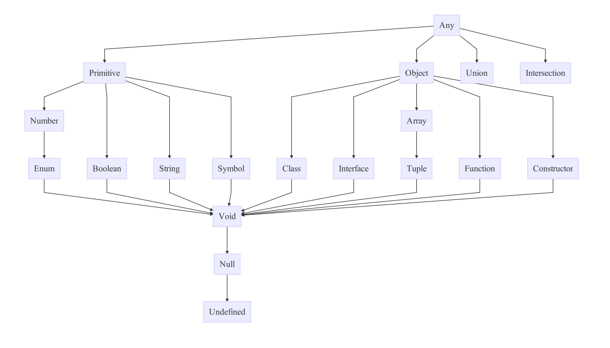

# TypeScript
* https://www.typescriptlang.org/index.html

## example
* `greeter.ts`

```typescript
function greeter(person: string) {
    return "Hello, " + person;
}

let user = "Kenu";

console.log(greeter(user));
```

## install, compile and run
* `npm install -g typescript`
* `tsc greeter.ts`
* `node greeter.js`

## ts-node
* `npm i -g ts-node`
* `ts-node  greeter.js`

## TypeScript Type 계층도

* image from: https://github.com/bcherny/language-types-comparison

## Object Oriented Programming
* 객체 지향 프로그래밍
* SOLID
  * SRP (단일책임의 원칙: Single Responsibility Principle)
  * OCP (개방폐쇄의 원칙: Open Close Principle)
  * LSP (리스코브 치환의 원칙: The Liskov Substitution Principle)
  * ISP (인터페이스 분리의 원칙: Interface Segregation Principle)
  * DIP (의존성역전의 원칙: Dependency Inversion Principle)
* ref: http://www.nextree.co.kr/p6960/

* 풀어서 얘기하자면(#그래도 #어려움)
    * 어떤 변화에 의해 클래스를 변경해야 하는 이유는 오직 하나뿐이어야 함
    * 소프트웨어의 구성요소(컴포넌트, 클래스, 모듈, 함수)는 확장에는 열려있고, 변경에는 닫혀있어야 한다는 원리
    * 서브 타입은 언제나 기반 타입으로 교체할 수 있어야 한다.
    * 한 클래스는 자신이 사용하지 않는 인터페이스는 구현하지 말아야 한다는 원리
    * 실제 사용 관계는 바뀌지 않으며, 추상을 매개로 메시지를 주고 받음으로써 관계를 최대한 느슨하게 만드는 원칙

## Object
* 객체란 속성과 행동을 포함
* 속성 : state, property, attribute, field, member variable
  * 상태를 저장
  * Car : 검은색, 바퀴수4개
* 행동 : behavior, method, function
  * 기능을 수행함
  * 매개변수를 인자로 받음 _f(x)_
  * 차 : 가속하다(), 멈추다()

## 클래스와 인스턴스
* 클래스는 도장(Type)과 같음. 청사진
* 인스턴스는 종이(메모리)위에 찍힌 도장자국과 같음 
* `new` 키워드 사용해서 메모리 위치 정해줌
* `Car car = new Car();`
* 클래스에 `()`이 붙은 것을 생성자(Constructor)라고 함
* 인스턴스는 변수와 같은 역할 == 쓰고 버릴 수도 있음(메모리 해제)

## TypeScript Class
* 전통적인 JavaScript는 재사용 가능한 컴포넌트를 만들기 위해 함수와 프로토타입 기반의 상속을 사용

### 예제

```ts
class Greeter {
    greeting: string;
    constructor(message: string) {
        this.greeting = message;
    }
    greet() {
        return "Hello, " + this.greeting;
    }
}

let greeter = new Greeter("world");
console.log(greeter);
```
* code from : https://typescript-kr.github.io/pages/Classes.html

## 상속 (Inheritance)
* 기존 클래스 확장
* 키워드 : `extends`, `super`
* `Child extends Papa`

## 재정의 (Override)
* 부모의 함수 재정의

## 오버로딩 (Overloads)
* 다양한 인수를 받는 함수 선언 가능
* 저글링 8마리 = 히드라 4마리 = 울트라리스크 2마리
* 함수별 구현 안됨 ㅠㅠ

```ts
let suits = ["hearts", "spades", "clubs", "diamonds"];

function pickCard(x: {suit: string; card: number; }[]): number;
function pickCard(x: number): {suit: string; card: number; };
function pickCard(x): any {
    // Check to see if we're working with an object/array
    // if so, they gave us the deck and we'll pick the card
    if (typeof x == "object") {
        let pickedCard = Math.floor(Math.random() * x.length);
        return pickedCard;
    }
    // Otherwise just let them pick the card
    else if (typeof x == "number") {
        let pickedSuit = Math.floor(x / 13);
        return { suit: suits[pickedSuit], card: x % 13 };
    }
}
```


## 지정자 (Modifier)
* `public`, `private`, `protected`
* `readonly` : 매개변수 프로퍼티

```ts
class Octopus {
    readonly numberOfLegs: number = 8;
    constructor(readonly name: string) {
    }
}
```

## 접근자 (Accessors)

* getter/setter

```ts
let passcode = "secret passcode";

class Employee {
    private _fullName: string;

    get fullName(): string {
        return this._fullName;
    }

    set fullName(newName: string) {
        if (passcode && passcode == "secret passcode") {
            this._fullName = newName;
        }
        else {
            console.log("오류 : employee의 무단 업데이트!");
        }
    }
}

let employee = new Employee();
employee.fullName = "Bob Smith";
if (employee.fullName) {
    console.log(employee.fullName);
}
```

## 정적 프로퍼티 (Static Properties)
* `this`가 아닌 클래스에서 바로 접근. `Grid.origin.x`

```ts
class Grid {
    static origin = {x: 0, y: 0};
    calculateDistanceFromOrigin(point: {x: number; y: number;}) {
        let xDist = (point.x - Grid.origin.x);
        let yDist = (point.y - Grid.origin.y);
        return Math.sqrt(xDist * xDist + yDist * yDist) / this.scale;
    }
    constructor (public scale: number) { }
}
```

## 추상 클래스 (Abstract Classes)
* interface(구현 안된 함수 `{}` 부분이 없는 함수)를 포함한 클래스
* `new` 사용 안됨
* 상속해서 구현해야 사용할 수 있음

## Symbol Type
* `let greeterMaker: typeof Greeter = Greeter;`
* 인스턴스 타입이 아닌 "`Greeter` 클래스 자체의 타입을 제공"
  * 생성자 함수의 타입인 "`Greeter`라는 Symbol 타입을 제공"

## ref
* in 5 minutes
  * https://www.typescriptlang.org/docs/handbook/typescript-in-5-minutes.html
* TypeScript Deep Dive
  * https://basarat.gitbooks.io/typescript/content/
