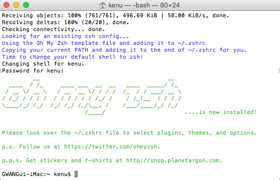

# zsh

* http://www.zsh.org
* https://ohmyz.sh/
* 인터랙티브한 사용을 위해 설계된 쉘, 파워풀한 스크립팅 언어
* git 사용시 브랜치 등을 프롬프트에 보여주며 매우 편리함
* history 기능 압도적

## 설치(맥)
* 필요조건
  * brew (http://brew.sh)

* `sh -c "$(curl -fsSL https://raw.github.com/robbyrussell/oh-my-zsh/master/tools/install.sh)"`


* 정상적으로 설치되었다면 cmd+N 으로 zsh로 실행됨
* 만약 그대로라면 `chsh -s /usr/local/bin/zsh` 명령으로 shell 변경 가능

## 설치

### Remote CentOS
```
su
yum install zsh
exit

curl -OL https://github.com/robbyrussell/oh-my-zsh/raw/master/tools/install.sh
bash install.sh
```


## 참고
* http://sourabhbajaj.com/mac-setup/iTerm/zsh.html
* 터미널 초보의 필수품인 Oh My ZSH!를 사용하자
  * https://nolboo.github.io/blog/2015/08/21/oh-my-zsh/
* Install Oh My Zsh on Ubuntu EC2
  * https://paikialog.wordpress.com/2012/02/29/install-oh-my-zsh-on-ubuntu-ec2/
