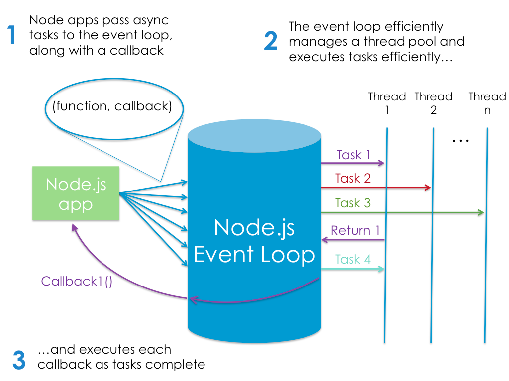

# node.js
[toc]

## JS Warm Up

* JavaScript
* JSON

## node.js 개요

```
Node.js® is a platform 
built on Chrome's JavaScript runtime 
for easily building fast, scalable network applications. 
Node.js uses an event-driven, non-blocking I/O model 
that makes it lightweight and efficient, perfect 
for data-intensive real-time applications 
that run across distributed devices.
```
### 특징
* JavaScript 기반
* Server-side
* Command Tool
* Desktop Application

### 장점
* 쉬운 시작
* 모듈 154,772 total packages
* 성능 개선
  * [linkedin 사례](http://highscalability.com/blog/2012/10/4/linkedin-moved-from-rails-to-node-27-servers-cut-and-up-to-2.html)
  * 서버 감축 Ruby + Mongrel 30대 -> node.js 3대
  * Frontend, Backend 개발자 소통 원활
  * 잡다한 작업 감소해서 로직에 집중
* C/C++ Addon
  * https://nodejs.org/api/addons.html

### 단점
* No Silver Bullet
  * CPU과다 사용시 이슈
  * 아직 < 1.0
* 예외처리 실수하면 서버 다운
* Callback Hell


## 비동기 프로그래밍
* 자바스크립트의 경우 비동기 코드 패턴이 다반사
* 기존 코드와 달리 콜백 함수를 함께 넘겨주는 형태
* 이벤트 핸들링에 많이 쓰이는 기법
* 이벤트 루프 사용으로 싱글쓰레드 동작

### blocking, non-blocking

* Input/Output
* IO latency
  * L1: 3 cycles
  * L2: 14 cycles
  * RAM: 250 cycles
  * DISK: 41,000,000 cycles 
  * NETWORK: 240,000,000 cycles

from: https://www.dropbox.com/s/o9g4m7tug3yt1xx/jsconf2009-nodejs.pdf?dl=0

* blocking code
```
var result = db.query("select * from T");
// use result
```

* non-blocking code
```
db.query("select * from T", 
  function(result) {
    // use result
  }
);
```


### 이벤트 루프



from [blog.udemy.com/learn-node-js/](https://lh4.googleusercontent.com/pwtI1uBbT5Gthva6sGtKu_L3Ih3w2oxt-LA28mEamjrz6dKl87NFKiTxgzlHfGhIuFF107PxLFeWMdc8z3dchWtpqpcaqE4D4nrcSx3UQmfEDmJTL_LzNKQVjg)

* 이벤트 루프 사용으로 싱글쓰레드 동작
  * 기존 서버는 쓰레드 기반
  * 아파치 등은 커넥션 증가에 따라서 메모리 증가
* nginx는 이벤트 루프 방식


### 안티 패턴
```
“헤이, probablyExpensiveFunction(), 니 일을 해줘. 하지만 나 Single Node.js 쓰레드는 네가 끝낼 때까지 여기서 기다리지 않을거야. 네 아래에 있는 코드 라인을 계속 실행할거야. 그러니 여기 이 callbackFunction()을 가져가서 네가 너의 비싼 일을 모두 끝냈을 때 호출해 주겠니? 고마워!”
```
from: http://www.nodebeginner.org/index-kr.html#how-to-not-do-it

## 서버사이드 자바스크립트 개발환경 설치
* http://nodejs.org

## 모듈 만들고 참조하기
* commonjs
* require()

## npm 을 통한 확장
* http://npmjs.org
* package.json


## expressjs 웹 프레임워크
* http://expressjs.com/
* npm install -g express-generator
* express myapp

## socket.io 모듈
* socket.io

## node.js PaaS 활용 - heroku
* https://www.heroku.com/
* http://okdevtv.com/tip/nodehosting.html


## MariaDB + node.js
* https://github.com/felixge/node-mysql
* https://github.com/mscdex/node-mariasql
* install MariaDB
  * `vi /etc/yum.repos.d/MariaDB.repo`
```
# MariaDB 10.0 CentOS repository list - created 2015-06-10 04:26 UTC
# http://mariadb.org/mariadb/repositories/
[mariadb]
name = MariaDB
baseurl = http://yum.mariadb.org/10.0/centos7-amd64
gpgkey=https://yum.mariadb.org/RPM-GPG-KEY-MariaDB
gpgcheck=1
```

```
# yum install MariaDB-server MariaDB-client
# service mysql start
# mysql_secure_installation
```

```
GRANT ALL PRIVILEGES ON *.* TO javauser@'%'
  IDENTIFIED BY 'javadude' WITH GRANT OPTION;

create database javatest;
use javatest;
create table testdata (
   id int not null auto_increment primary key,
   foo varchar(25),
   bar int);
insert into testdata values(null, 'hello', 12345);

```

```
mysql -ujavatest -p -h104.236.46.34
```

## MongoDB + node.js
* http://okdevtv.com/mongodb_nodejs.html


## Node.js for PHP Developer
php
```
function roomlist() {
    $rooms = array();
    $room_list = mysql_query(
        'SELECT room FROM '.SQL_PREFIX.'chats GROUP BY room ORDER BY room ASC'
    );
    while (
        $row = mysql_fetch_assoc($room_list)) {
        $room = $row['room'];
        $rooms[] = $room;
    }
    print json_encode($r);
}
```

node.js
```
function roomlist() {
    varrooms = [];
    link.query(
        'SELECT room FROM ' + SQL_PREFIX + 'chats GROUP BY room ORDER BY room ASC',
        function (err, rows, fields) {
            for (var r = 0; r < rows.length; ++r) {
                var row = rows[r];
                var room = row['room'];
                rooms.push(room);
            }
            res.writeHead(200, {
                'Content-Type': 'text/plain'
            });
            res.end(JSON.stringify(r));
        }
    });
};
```

code from: Node.js for PHP developers, viii
### Chapters
Chapter 1, Node.js Basics
Chapter 2, A Simple Node.js Framework
Chapter 3, Simple Callbacks
Chapter 4, Advanced Callbacks
  * This chapter presents a more sophisticated and generic way to refactor blocking PHP 4 source code to simulate anonymous functions, function variables, and clo‐ sure.
  * For PHP 5 source code, it explains how to use PHP 5 features to actually implement anonymous functions, function variables, and closure.

Chapter 5, HTTP Responses
Chapter 6, Syntax
Chapter 7, Variables
Chapter 8, Classes
Chapter 9, File Access
Chapter 10, MySQL Access
Chapter 11, Plain Text, JSON, and XML
Chapter 12, Miscellaneous Functions
  * Node.js implementations for PHP API functions.
  * speed along conversion
  * contrast PHP and Node.js.

## Node.js for Java Developer
* enide plugin
* https://strongloop.com/strongblog/node-js-java-getting-started/


## 디버깅
* https://nodejs.org/api/debugger.html
* node-inspector
  * https://github.com/node-inspector/node-inspector#node-inspector
  * 크롬브라우저를 독립적으로 띄워서 크롬 인스펙터 UI로 디버깅 가능
  * http://okjsp.tistory.com/1165644244


## Test Frameworks
* QUnit
  * http://qunitjs.com/
  * http://backbonejs.org/test/
    * test source  https://github.com/jashkenas/backbone/blob/master/test/index.html
* Testing Essentials
  * http://thenodeway.io/posts/testing-essentials/

* UI 테스트
  * GUITAR
    * http://naver.github.io
    * http://dev.naver.com/projects/guitar
  * jmeter maven
    * jenkins jmeter


## 서버 모니터링
* uptime
  * https://github.com/fzaninotto/uptime
  * http://localhost:8082/

```
$ cd ~/dev/mongodb/bin
$ mkdir -p ~/data/db
$ ./mongod --dbpath=/Users/kenu/data/db

$ cd ~/dev/mongodb/bin
$ mongo
MongoDB shell version: 2.4.9
connecting to: test
> use uptime
switched to db uptime
> db.addUser('uptime', 'okpass');
{
	"user" : "uptime",
	"readOnly" : false,
	"pwd" : "fdc9e10c8f90fac0c9fe786f28cc04f4",
	"_id" : ObjectId("5577b97a62555c0332f63e6f")
}
> exit


$ git clone git://github.com/fzaninotto/uptime.git
$ cd uptime
$ npm install


```

* node server monitor
  * [alternative](https://strongloop.com/strongblog/comparison-tools-to-automate-restarting-node-js-server-after-code-changes-forever-nodemon-nodesupervisor-nodedev/)
  * forever
  * nodemon
  * node-supervisor
  * node-dev
* PM2
  * https://github.com/Unitech/PM2

## 참고
* node.js
  * http://nodejs.org
* http://bit.ly/okjavascript
* http://bit.ly/oknodejs
* node.js 내가-쓰기로-선택한-이유
  * https://vinebrancho.wordpress.com/2014/03/24/node-js-내가-쓰기로-선택한-이유/
* octobersky.js
  * https://github.com/octoberskyjs
* PM2 (Process Monitor 2)
  * http://devo.ps/blog/goodbye-node-forever-hello-pm2/
