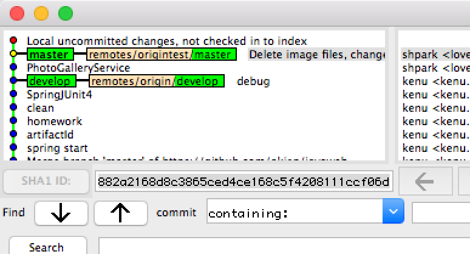

# Git Status

## branch diverged
```
On branch master
Your branch and 'origin/master' have diverged,
and have 2 and 7 different commits each, respectively.
  (use "git pull" to merge the remote branch into yours)
```

* Status



* Solve

```
# folder backup
# git local commit
# git pull remote
# merge conflict
# git local commit
# git push

gitk
git status
git pull origin master
git commit -m "tmp"
git commit -am "tmp"
git pull origin master
git add .
git status
git commit -m "tmp2"
git pull origin master
atom .
git status
git add .
git commit -m "tmp3"
git status
git push origin master
gitk
```

* 결과


## 파일 하나 롤백
```
git checkout b1fea8b -- server.js
```

## git diff
* 이전 파일과 비교
```
git diff HEAD^ HEAD
```

* As of Git 1.8.5, @ is an alias for HEAD, so you can use:
```
git diff @~..@
```

* The following will also work:
```
git show
```

* If you want to know the diff between head and any commit you can use:
```
git diff commit_id HEAD
```

* And this will launch your visual diff tool (if configured):
```
git difftool HEAD^ HEAD
```
* from https://stackoverflow.com/questions/9903541/finding-diff-between-current-and-last-versions

## errors
* The remote end hung up unexpectedly
```
fatal: The remote end hung up unexpectedly
fatal: early EOF
fatal: index-pack failed
```

* Solve

```
git config http.postBuffer 724288000
```
