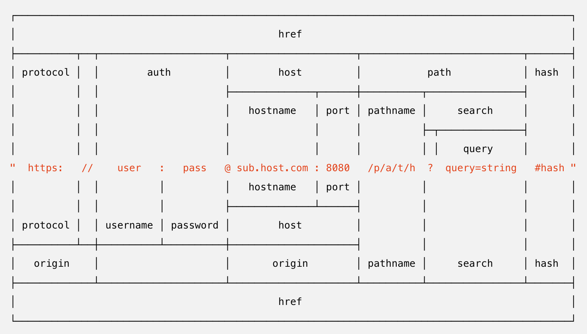

# Node.js 기능

## REPL 사용하기

* JS는 스크립트 언어
* 컴파일 하지 않아도 코드실행 가능
* REPL(Read Eval Print Loop)
* `node` 로 REPL 실행. ctrl+D로 종료
* 한두 줄 코드 실행하기는 좋음

## JS 파일 실행하기

* 아무 위치에서나 실행 가능
* `helloWorld.js`

```js
function helloWorld() {
  console.log('Hello World');
  helloNode();
}
function helloNode() {
  console.log('Hello Node');
}
helloWorld();
```

* node [JS 파일 경로]
* `.js` 생략 가능
* `node helloWorld`


## 모듈로 만들기
* 모듈로 만들어두면 여러 프로그램에서 재사용 가능
* 브라우저의 모듈은 크롬 60부터 사용가능, 하지만 아직 사용은 비추천. ex) IE
* `var.js`

```js
const odd = '홀수입니다';
const even = '짝수입니다';

module.exports = {
  odd,
  even
};
```

* `func.js`

```js
const {odd, even} = require('./var');

function checkOddOrEven(num) {
  if (num % 2) { // 홀수면
    return odd;
  }
  return even;
}

module.exports = checkOddOrEven;
```

* `index.js`

```js
const {odd, even} = require('./var');
const checkNumber = require('./func');

function checkStringOddOrEven(str) {
  if (str.length % 2) {
    return odd;
  }
  return even;
}

console.log(checkNumber(10));
console.log(checkStringOddOrEven('hello');
```

* 모듈로부터 값을 불러올 때 변수 이름을 다르게 지정할 수 있음
* `checkOddOrEven`이 `checkNumber`로 사용
* `*.mjs` ES2015에 도입된 모듈 시스템. 
  * `node --experimental-modules 파일명` 처럼 옵션 필요

## 노드 내장 객체 알아보기
* 내장 객체와 내장 모듈
* 브라우저의 `window` 객체와 비슷

### `global`
* 전역객체
* 생략 가능 
  * `global.require` -> `require`
  * `global.console` -> `console`
* node.js에는 DOM(Document Object Model), BOM(Browser Object Model)이 없기 때문에 `window`, `document` 사용할 수 없음
* `global` 에는 수십 가지 속성이 담겨 있음

* `globalA.js`

```js
module.exports = () => global.message;
```

* `globalB.js`

```js
const A = require('./globalA');

global.message = '안녕하세요';
console.log(A());
```

* `golbalB`에 넣은 `global.message` 값을 `globalA`에서 접근 가능

### `console`
* `console` 디버깅을 위해 사용
* `console.js`

### 타이머
* `timer.js`


### `__filename`, `__dirname`
* `filename.js`


### module, exports
* exports 객체로도 모듈 생성 가능
* `var.js`

```js
exports.odd = '홀수입니다';
exports.even = '짝수입니다';
```
* `console.log(module.exports === exports)` 


### process
* 현재 실행되고 있는 노드 프로세스에 대한 정보를 담고 있음

#### `process.env`
* 시스템 환경 변수
* API 키를 코드 대신 환경변수에 설정해서 활용

#### `process.nextTick(콜백)`
* 이벤트 루프가 다른 콜백 함수들보다 `nextTick`의 콜백 함수를 우선으로 처리하도록 만듬
* `nextTick.js`
* `process.nextTick`은 `setImmediate`나 `setTimeout`보다 먼저 실행됨.
* 코드 맨 밑에 `Promise`를 넣은 것은 `resolve`된 `Promise`도 `nextTick`처럼 다른 콜백들보다 우선시되기 때문
* `process.nextTick`과 `Promise`를 `마이크로태스크(microtask)`라고 따로 구분지어 부름

#### `process.exit(코드)`
* 실행중인 노드 프로세스 종료
* `exit.js`

## 내장 모듈 사용하기
* 운영체제 정보에도 접근, 클라이언트가 요청한 주소에 대한 정보도 가져올 수 있음
* 노드 버전마다 차이가 있음

### `os`
* `os.js`

### `path`
* `path.js`

### `url`


* `url.js`
* `searchParams.js`


### `querystring`
* `querystring.js`

### `crypto`
* 다양한 방식의 암호화 도와주는 모듈

#### 단방향 암호화
* 비밀번호 등 복호화가 필요하지 않은 경우
* 암호화된 문자열로만 비교
* `hash.js`
  * `crypto.createHash('sha512')` : ~~`md5`~~, ~~`sha1`~~, `sha256`, `sha512`
  * `update(문자열)` : 비밀번호 등 변환할 문자열
  * `digest(인코딩)` : `base64`, `hex`, `latin1`
* `pbkdf2.js`
  * node.js에서 기본 지원
  * salt라고 불리는 문자열을 붙인 후 해시 알고리즘을 반복 적용해서 암호화
  * `randomBytes()` : 64바이트 길이의 문자열 생성 `salt`
  * `crypto.pbkdf2(비밀번호, salt, 반복횟수, 출력바이트, 해시알고리즘)`

#### 양방향 암호화
* 전화번호, 이메일 등 복호화가 필요한 경우
* key 사용해서 암호화하고 같은 key 사용해서 복호화
* `cipher.js`
  * `crypto.createCipher(알고리즘, 키)`
  * `crypto.getCiphers()` : 사용 가능한 알고리즘 목록

```
> crypto.getCiphers()
[ 'aes-128-cbc',
  'aes-128-cbc-hmac-sha1',
  'aes-128-cbc-hmac-sha256',
  'aes-128-ccm',
  'aes-128-cfb',
  'aes-128-cfb1',
  'aes-128-cfb8',
  'aes-128-ctr',
  'aes-128-ecb',
  'aes-128-gcm',
  'aes-128-ofb',
  'aes-128-xts',
  'aes-192-cbc',
  'aes-192-ccm',
  'aes-192-cfb',
  'aes-192-cfb1',
  'aes-192-cfb8',
  'aes-192-ctr',
  'aes-192-ecb',
  'aes-192-gcm',
  'aes-192-ofb',
  'aes-256-cbc',
  'aes-256-cbc-hmac-sha1',
  'aes-256-cbc-hmac-sha256',
  'aes-256-ccm',
  'aes-256-cfb',
  'aes-256-cfb1',
  'aes-256-cfb8',
  'aes-256-ctr',
  'aes-256-ecb',
  'aes-256-gcm',
  'aes-256-ofb',
  'aes-256-xts',
  'aes128',
  'aes192',
  'aes256',
  'bf',
  'bf-cbc',
  'bf-cfb',
  'bf-ecb',
  'bf-ofb',
  'blowfish',
  'camellia-128-cbc',
  'camellia-128-cfb',
  'camellia-128-cfb1',
  'camellia-128-cfb8',
  'camellia-128-ecb',
  'camellia-128-ofb',
  'camellia-192-cbc',
  'camellia-192-cfb',
  'camellia-192-cfb1',
  'camellia-192-cfb8',
  'camellia-192-ecb',
  'camellia-192-ofb',
  'camellia-256-cbc',
  'camellia-256-cfb',
  'camellia-256-cfb1',
  'camellia-256-cfb8',
  'camellia-256-ecb',
  'camellia-256-ofb',
  'camellia128',
  'camellia192',
  'camellia256',
  'cast',
  'cast-cbc',
  'cast5-cbc',
  'cast5-cfb',
  'cast5-ecb',
  'cast5-ofb',
  'des',
  'des-cbc',
  'des-cfb',
  'des-cfb1',
  'des-cfb8',
  'des-ecb',
  'des-ede',
  'des-ede-cbc',
  'des-ede-cfb',
  'des-ede-ofb',
  'des-ede3',
  'des-ede3-cbc',
  'des-ede3-cfb',
  'des-ede3-cfb1',
  'des-ede3-cfb8',
  'des-ede3-ofb',
  'des-ofb',
  'des3',
  'desx',
  'desx-cbc',
  'id-aes128-CCM',
  'id-aes128-GCM',
  'id-aes128-wrap',
  'id-aes192-CCM',
  'id-aes192-GCM',
  'id-aes192-wrap',
  'id-aes256-CCM',
  'id-aes256-GCM',
  'id-aes256-wrap',
  'id-smime-alg-CMS3DESwrap',
  'idea',
  ... 19 more items ]
```

### `util`
* `util.js`


## 파일 시스템 접근하기
* `const fs = require('fs')`
* `readme.txt`
* `readFile.js`
  * `readFile()` 결과는 버퍼(메모리의 데이터) 형식, `.toString()` 을 통해서 문자열로 변환  
* `writeFile.js`

### 동기 메서드와 비동기 메서드
* `readme2.txt`
* `async.js`
* `sync.js`
* `asyncOrder.js`


### 버퍼와 스트림 이해하기
* 로딩중일 때 버퍼링, 송출할 때는 스트리밍
* 버퍼를 직접 다루는 클래스 : `Buffer`
* `buffer.js`
  * `from(문자열)` : 문자열을 버퍼로 변환
  * `toString(인코딩)` : 버퍼를 다시 문자열로 `base64`, `hex` 인코딩 가능
  * `concat(배열)` : 배열 안에 든 버퍼들을 하나로 합침
  * `alloc(바이트)` : 빈 버퍼 생성
* 버퍼의 크기를 작게 만들어서 여러 번에 나눠서 보내는 방식
  * 1MB 메모리로 100MB 파일 전송
  * 이 작업을 편리하게 만든 것이 **스트림**
* `readme3.txt`
* `createReadStream.js`
* `createWriteStream.js`
* `readme4.txt`
* `pipe.js`
* `gzip.js`

### 기타 fs 메서드

* `fsCreate.js`

```js
const fs = require('fs');

fs.access('./folder', fs.constants.F_OK | fs.constants.R_OK | fs.constants.W_OK, (err) => {
  if (err) {
    if (err.code === 'ENOENT') {
      console.log('폴더 없음');
      fs.mkdir('./folder', (err) => {
        if (err) {
          throw err;
        }
        console.log('폴더 만들기 성공');
        fs.open('./folder/file.js', 'w', (err, fd) => {
          if (err) {
            throw err;
          }
          console.log('빈 파일 만들기 성공', fd);
          fs.rename('./folder/file.js', './folder/newfile.js', (err) => {
            if (err) {
              throw err;
            }
            console.log('이름 바꾸기 성공');
          });
        });
      });
    } else {
      throw err;
    }
  } else {
    console.log('이미 폴더 있음');
  }
});
```

* `fsDelete.js`

```js
const fs = require('fs');

fs.readdir('./folder', (err, dir) => {
  if (err) {
    throw err;
  }
  console.log('폴더 내용 확인', dir);
  fs.unlink('./folder/newFile.js', (err) => {
    if (err) {
      throw err;
    }
    console.log('파일 삭제 성공');
    fs.rmdir('./folder', (err) => {
      if (err) {
        throw err;
      }
      console.log('폴더 삭제 성공');
    });
  });
});
```

* `copyfile.js`

```js
const fs = require('fs');

fs.copyFile('readme4.txt', 'writeme4.txt', (error) => {
  if (error) {
    return console.error(error);
  }
  console.log('복사 완료');
});
```


## 이벤트 이해하기

* `event.js`

```js
const EventEmitter = require('events');

const myEvent = new EventEmitter();
myEvent.addListener('event1', () => {
  console.log('이벤트 1');
});

myEvent.on('event2', () => {
  console.log('이벤트 2');
});

myEvent.on('event2', () => {
  console.log('이벤트 2 추가');
});

myEvent.emit('event1');
myEvent.emit('event2');

myEvent.once('event3', () => {
  console.log('이벤트 3');
});

myEvent.emit('event3');
myEvent.emit('event3');

myEvent.on('event4', () => {
  console.log('이벤트 4');
});

myEvent.removeAllListeners('event4');
myEvent.emit('event4');

const listener = () => {
  console.log('event5');
}
myEvent.on('event5', listener);
myEvent.removeListener('event5', listener);
myEvent.emit('event5');

console.log(myEvent.listenerCount('event2'));
```

* `on(이벤트명, 콜백)`
* `addListener(이벤트명, 콜백)`
* `emit(이벤트명)`
* `once(이벤트명, 콜백)`
* `removeAllListeners(이벤트명)`
* `removeListener(이벤트명, 리스너)`
* `off(이벤트명, 콜백)`
* `listenCount(이벤트명)`


## 예외 처리하기

* 예외 처리 못하면 Node 프로세스 멈춤. 예) 서버 다운
* 멀티 스레드 프로그램에서 하나가 멈추면 다른 스레드가 대신
* 싱글 스레드인 노드는 전체 서버가 멈춘다는 의미
* 예기치 못한 에러 처리하는 기술 필수

* 문법상의 에러 없다고 가정 - 실제 배포용 코드에 문법 에러가 있다는 것은 말이 안됨
* 좋은 에디터, 좋은 문법 검사 도구

* `error1.js`

```js
setInterval(() => {
  console.log('시작');
  try {
    throw new Error('서버를 고장내주마!');
  } catch (err) {
    console.error(err);
  }
}, 1000);
```

* `error2.js`

```js
const fs = require('fs');

setInterval(() => {
  fs.unlink('./abcdefg.js', (err) => {
    if (err) {
      console.error(err);
    }
  });
}, 1000);
```
* 없는 파일 지우지만, 내장 모듈의 에러는 실행 중인 프로세스를 멈추지 않음

* `error3.js`

```js
process.on('uncaughtException', (err) => {
  console.error('예기지 못한 에러', err);
});

setInterval(() => {
  throw new Error('서버를 고장내주마!');
}, 1000);

setTimeout(() => {
  console.log('실행됩니다.')
}, 2000);
```

* `uncaughtException` 이벤트 리스너로 모든 에러 처리 가능
* 하지만 노드 공식 문서에서는 최후의 수단으로 권함
* 에러 발생시 철저히 기록하는 습관과 주기적 확인과 보완

## 함께 보면 좋은 자료

* http://bit.ly/oknodejs
* https://nodejs.org/dist/latest-v10.x/docs/api/
* https://nodejs.org/dist/latest-v10.x/docs/api/process.html#process_event_uncaughtexception
* https://nodejs.org/dist/lastest-v10.x/docs/api/fs.html#fs_fs_promises_api
