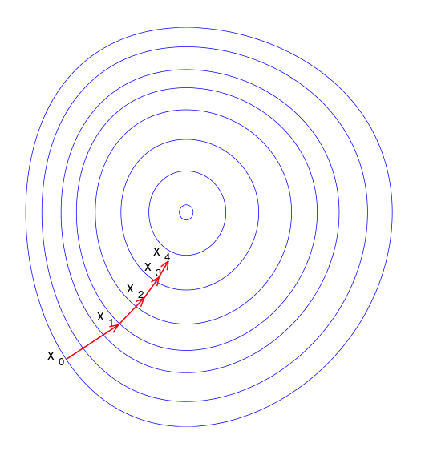
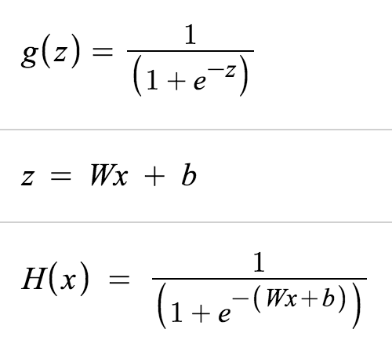

# TensorFlow
* ML Library
* https://www.tensorflow.org/

## Prerequisite
* python https://okdevtv.com/mib/python
  * windows : 3.5.3 (not 3.6.0)

## install v0.12.1
* https://www.tensorflow.org/install
* mac
  * virtualenv 사용

```
sudo pip install --upgrade virtualenv
virtualenv --system-site-packages ~/tensorflow
source ~/tensorflow/bin/activate
TF_BINARY_URL=https://storage.googleapis.com/tensorflow/mac/cpu/tensorflow-0.12.1-py2-none-any.whl
pip install --upgrade $TF_BINARY_URL
```
  * exit virtualenv mode
```
deactivate
```

* win
  * Python 3.5.3
  * https://www.microsoft.com/ko-KR/download/details.aspx?id=53587
    * Microsoft Visual C++ 2015 재배포 가능 패키지(x86) 14.0.23504 필요

```
pip install --upgrade virtualenv
virtualenv --system-site-packages -p python.exe tensorflow
tensorflow\Scripts\activate
pip install --upgrade https://storage.googleapis.com/tensorflow/windows/cpu/tensorflow-0.12.1-cp35-cp35m-win_amd64.whl
```

  * exit virtualenv mode
```
deactivate
```
  * [matplotlib install for windows](//okdevtv.com/mib/python/matplotlib)


## install v1.0.0
* warning: most samples are not updated.
```
sudo pip install --upgrade virtualenv
virtualenv --system-site-packages ~/tensorflow
source ~/tensorflow/bin/activate
pip install --upgrade tensorflow
deactivate
```


## first example
```
import tensorflow as tf
import numpy as np

# Create 100 phony x, y data points in NumPy, y = x * 0.1 + 0.3
x_data = np.random.rand(100).astype(np.float32)
y_data = x_data * 0.1 + 0.3

# Try to find values for W and b that compute y_data = W * x_data + b
# (We know that W should be 0.1 and b 0.3, but TensorFlow will
# figure that out for us.)
W = tf.Variable(tf.random_uniform([1], -1.0, 1.0))
b = tf.Variable(tf.zeros([1]))
y = W * x_data + b

# Minimize the mean squared errors.
loss = tf.reduce_mean(tf.square(y - y_data))
optimizer = tf.train.GradientDescentOptimizer(0.5)
train = optimizer.minimize(loss)

# Before starting, initialize the variables.  We will 'run' this first.
init = tf.global_variables_initializer()

# Launch the graph.
sess = tf.Session()
sess.run(init)

# Fit the line.
for step in range(201):
    sess.run(train)
    if step % 20 == 0:
        print(step, sess.run(W), sess.run(b))

# Learns best fit is W: [0.1], b: [0.3]
```
* code from : https://www.tensorflow.org/get_started/

## Linear Regression


### Gradient Descent Method
* 경사하강법
* `tf.train.GradientDescentOptimizer()`
* 
* 

## Logistic Regression
* 
* 
* 0 or 1
* True of False

### Sigmoid
* https://www.desmos.com/calculator/vvl1zn7wfn

## Perceptron
* the perceptron is an algorithm for learning a binary classifier
0\\0&amp;{\text{otherwise}}\end{cases}}">

## softmax 
  * http://pythonkim.tistory.com/19
  * "softmax는 데이터를 2개 이상의 그룹으로 나누기 위해 binary classification을 확장한 모델이다."
  * "통계에서 가장 큰 값을 찾는 개념을 hardmax라고 부른다. softmax는 새로운 조건으로 가장 큰 값을 찾는 개념을 말한다. 일반적으로는 큰 숫자를 찾는 것이 hardmax에 해당하고, 숫자를 거꾸로 뒤집었을 경우에 대해 가장 큰 숫자를 찾는다면 softmax에 해당한다. 여기서는 우리가 알고 있는 큰 숫자를 찾는 것이 아니라는 뜻으로 쓰인다."

## Cross Entropy
* The cross-entropy measure has been used as an alternative to squared error.
* Cross-entropy can be used as an error measure when a network's outputs can be thought of as representing independent hypotheses
  * http://www.cse.unsw.edu.au/~billw/cs9444/crossentropy.html

## NCE loss
* noise-contrastive estimation loss
* 텐서플로우(TensorFlow)를 이용해 자연어를 처리하기(NLP) – Word Embedding(Word2vec)
  * http://solarisailab.com/archives/374

### Rectifier Linear Unit
* ReLU

## CNN
* Convolutional Neural Network
* 이미지를 작게 쪼개어서 분석하는 기법
* Convolutional Layer + Pooling Layer
* 참고: http://sanghyukchun.github.io/75/
* sparse weight, tied weight, equivariant representation

### Convolutional Layer
* 합성곱
  * 
* CNN Architecture
  * Convolutional Layers
  * Sub-sample Layers
  * 

### Pooling Layer
* 더 dimension이 낮은 feature map을 얻기 위하여 Subsampling
* convolution layer의 feature map을 조금 더 줄여주는 역할
  * 


## RNN
* Recurrent Neural Networks
* 레이어간 영향을 주는 NN
* speech recognition, language modeling, translation, image captioning…
* loop rnn
  * 
* unrolled
  * 
* image from: http://colah.github.io/posts/2015-08-Understanding-LSTMs/


### LSTM
* Long Short Term Memory
* Long Short Term Memory networks – usually just called “LSTMs” – are a special kind of RNN, capable of learning long-term dependencies.
* Hochreiter & Schmidhuber (1997) 
  * http://deeplearning.cs.cmu.edu/pdfs/Hochreiter97_lstm.pdf
* 

## NLU
* https://github.com/tensorflow/models/tree/master/syntaxnet
* natural language understanding (NLU)

### GRU

## GAN

## TensorFlow Term
* rank : dimension of tensor
* shape : rows and columns of tensor
* type : data type of tensor
* mlp : MultiLayer Perceptron

```
import numpy as np
tensor_1d = np.array([1.3, 1, 4.0, 23.99])

print tensor_1d

print tensor_1d[0]

tensor_1d.ndim

tensor_1d.shape

tensor_1d.type

import tensorflow as tf
tf_tensor = tf.convert_to_tensor(tensor_1d, dtype=tf.float64)
```

```
tensor_2d = np.array([(1,2,3,4), (5,6,7,8), (9,10,11,12), (13,14,15,16)])
print tensor_2d

tensor_2d[0:2,0:2]
```

### Random functions
* random_uniform() : Uniform Distribution Funtion
  * random_uniform(shape, minval, maxval, dtype, seed, name)
  * Uniform Distribution : 주어진 범위 내의 모든 수가 동일한 분포를 갖는 형태
* random_normal() : Normal Distribution Function
  * random_normal(shape, mean, stddev, name)

## term
* Max: what's the maximum of a function?
* Argmax: what's the input that gives us that maximum?
  * from : http://www.aiqus.com/forum/questions/26495/what-is-the-difference-between-argmax-and-max
* Epoch : learning cycle
* Perceptron : neural network model, feedforward network
  * single-layer perceptron
  * multilayer perceptrons
    * backpropagation

*  

  * image from : http://www.saedsayad.com/artificial_neural_network_bkp.htm
*  

  * image from : http://blog.refu.co/?p=931
* one-hot : 벡터에서 하나만 1이고 나머지는 0으로 채워진 경우 [0,0,0,1,0,0,0,0,0,0] == 3


## tasks
* 선형 회귀
  * 합격 여부 예측
* RNN
  * Chatbot
* CNN
  * 비슷한 이미지 찾기


## 서적
* 텐서플로 첫걸음
  * http://www.aladin.co.kr/shop/wproduct.aspx?ItemId=89824250
* 텐서플로 입문
  * http://www.aladin.co.kr/shop/wproduct.aspx?ItemId=94238233
* 어서와! 머신러닝은 처음이지? (R)
  * http://www.aladin.co.kr/shop/wproduct.aspx?ItemId=99084501

## tensorboard
* TensorFlow 시각화 기능

### code
* `name="a"`
* `merged = tf.merge_all_summaries()`
* `writer = tf.train.SummaryWriter("/tmp/tensorflowlog", session.graph)`

### tensorboard 실행
```
tensorboard --logdir=/temp/tensorflowlogs
```
* http://localhost:6006/

## GPU
* https://www.tensorflow.org/tutorials/using_gpu
* 1) TensorFlow only supports GPUs on Linux. It may be possible to get it using a Mac one, but I haven't heard any reports of it.
  2) CUDA is only for NVidia GPUs
  * by nicki https://www.reddit.com/r/MachineLearning/comments/4nk45n/has_anyone_used_a_mac_gpu_with_tensorflow/
* CUDA needed
* device log
```
import tensorflow as tf
# Creates a graph.
a = tf.constant([1.0, 2.0, 3.0, 4.0, 5.0, 6.0], shape=[2, 3], name='a')
b = tf.constant([1.0, 2.0, 3.0, 4.0, 5.0, 6.0], shape=[3, 2], name='b')
c = tf.matmul(a, b)
# Creates a session with log_device_placement set to True.
sess = tf.Session(config=tf.ConfigProto(log_device_placement=True))
# Runs the op.
print(sess.run(c))
```

* output
```
Device mapping:
/job:localhost/replica:0/task:0/gpu:0 -> device: 0, name: Tesla K40c, pci bus
id: 0000:05:00.0
b: /job:localhost/replica:0/task:0/gpu:0
a: /job:localhost/replica:0/task:0/gpu:0
MatMul: /job:localhost/replica:0/task:0/gpu:0
[[ 22.  28.]
 [ 49.  64.]]
```

## VGA 확인
```
sudo yum install pciutils
lspci | grep -i vga
```

* set gpu

```
import tensorflow as tf
# Creates a graph.
with tf.device('/gpu:0'):
    a = tf.constant([1.0, 2.0, 3.0, 4.0, 5.0, 6.0], shape=[2, 3], name='a')
    b = tf.constant([1.0, 2.0, 3.0, 4.0, 5.0, 6.0], shape=[3, 2], name='b')
    c = tf.matmul(a, b)

# Creates a session with log_device_placement set to True.
sess = tf.Session(config=tf.ConfigProto(log_device_placement=True))
# Runs the op.
print(sess.run(c))
```


## ref
* 모두를 위한 머신러닝/딥러닝 강의
  * http://hunkim.github.io/ml/
  * https://github.com/aymericdamien/TensorFlow-Examples
* 시즌2 모두를 위한 딥러닝 - Deep Reinforcement Learning
  * https://www.inflearn.com/course/reinforcement-learning/
* 머신러닝_김성훈교수님 노트 by 파이쿵
  * http://pythonkim.tistory.com/category/%EB%A8%B8%EC%8B%A0%EB%9F%AC%EB%8B%9D_%EA%B9%80%EC%84%B1%ED%9B%88%EA%B5%90%EC%88%98%EB%8B%98
* Practical Deep Learning For Coders
  * http://course.fast.ai/index.html
* TensorFlow Tutorials by 골빈해커
  * https://github.com/golbin/TensorFlow-Tutorials
* CodeOnWeb tensorflow
  * https://codeonweb.com/entry/12045839-0aa9-4bad-8c7e-336b89401e10
* 솔라리스의 인공지능 연구실
  * http://solarisailab.com/
* 내가 찾은 Deep Learning 공부 최단경로(?)
  * http://blog.naver.com/chesterroh/220920668374
* https://github.com/TensorFlowKR/awesome_tensorflow_implementations
* Char RNN : https://github.com/sherjilozair/char-rnn-tensorflow
* Word RNN : https://github.com/hunkim/word-rnn-tensorflow
* http://karpathy.github.io/2015/05/21/rnn-effectiveness/
* Fundamental of Reinforcement Learning
  * https://dnddnjs.gitbooks.io/rl/content/