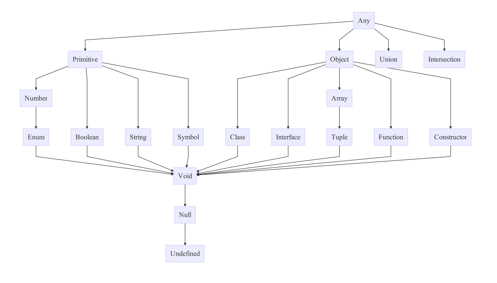

# TypeScript
* https://www.typescriptlang.org/index.html

## example
* `greeter.ts`

```typescript
function greeter(person: string) {
    return "Hello, " + person;
}

let user = "Kenu";

console.log(greeter(user));
```

## install, compile and run
* `npm install -g typescript`
* `tsc greeter.ts`
* `node greeter.js`

## ts-node
* `npm i -g ts-node`
* `ts-node  greeter.js`

## TypeScript Type 계층도

* image from: https://github.com/bcherny/language-types-comparison

## ref
* in 5 minutes
  * https://www.typescriptlang.org/docs/handbook/typescript-in-5-minutes.html
* TypeScript Deep Dive
  * https://basarat.gitbooks.io/typescript/content/
