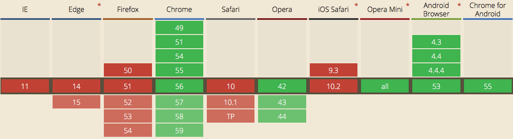

# WebP
* Optimized picture format by google
* https://developers.google.com/speed/webp/

## install
* `brew install webp`

## Usage
* basic
```
cwebp filename.png -o filename.webp
cwebp -q 80 filename.png -o filename.webp
```

* resize
```
cwebp -q 80 -resize 440 276 filename.png -o filename.webp
```

## example
```
917796  elk-dashboard_2418_1344.png
560557  elk-dashboard_2418_1344.jpg
189400  elk-dashboard_2418_1344.webp
216290  elk-dashboard80_2418_1344.webp
 18794  elk-dashboard_470_276.webp
 15310  elk-dashboard_440_276.webp
```

## mac quick look plugin
```
brew cask install webpquicklook
```

## limit
* only in Chrome and Android, not Safari, Firefox and IE  

* check : http://caniuse.com/#feat=webp

## ref
* https://developers.google.com/speed/webp/docs/cwebp
* quick look plugins
  * https://github.com/sindresorhus/quick-look-plugins#webp