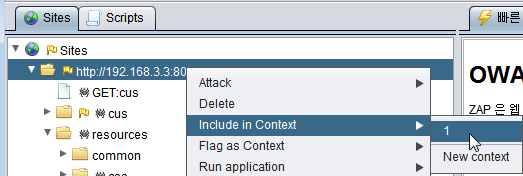
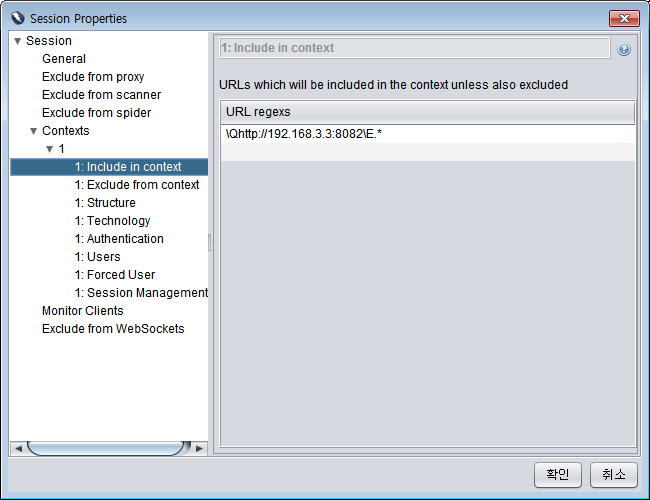
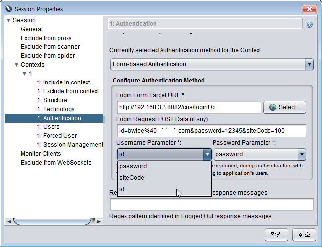
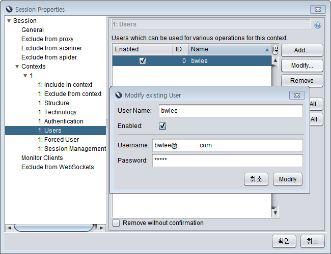
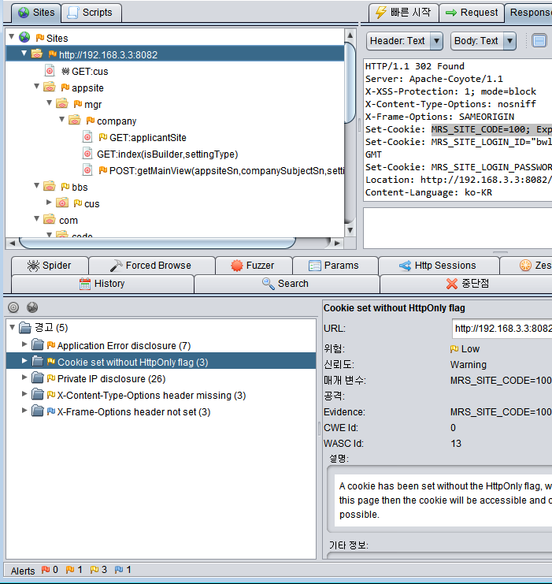
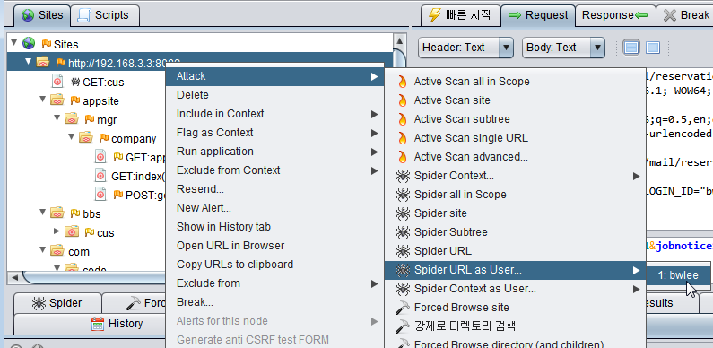
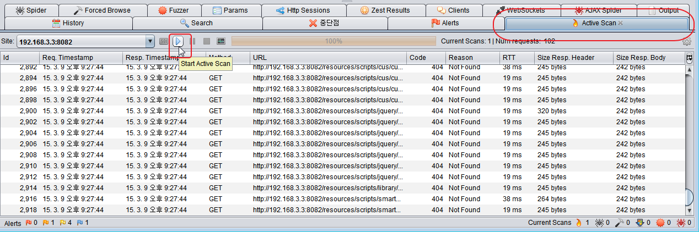
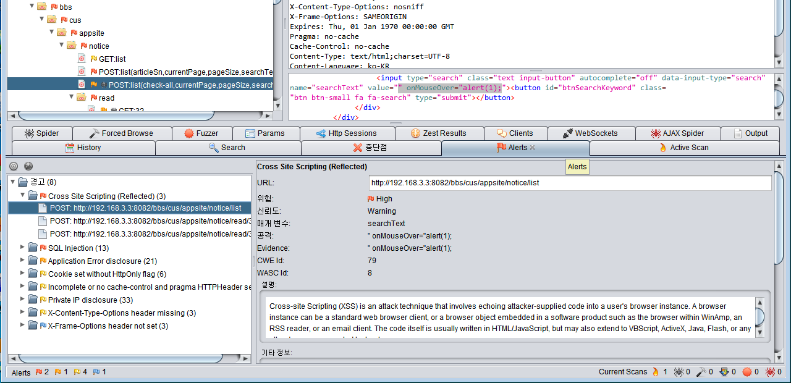

# Zed Attack Proxy(ZAP)
* 웹 애플리케이션 취약점 찾는 통합 테스팅 도구
* 오픈 소스 by [OWASP](https://www.owasp.org)
* https://www.owasp.org/index.php/OWASP_Zed_Attack_Proxy_Project
* Windows, Linux, macOS 프로그램
* Download : https://github.com/zaproxy/zaproxy/wiki/Downloads

## 간단 사용법
* 빠른 실행에 대상 사이트 URL을 넣어서 실행

***
* Sites 탭에 탐색된 페이지 주소가 나타남
* Alert 탭에 사이트의 취약점 종류와 해당 페이지 정보가 나타남

* 로그인을 하지 못했기 때문에 정보 제한됨

## 기본 사용법
* 브라우저 프록시 설정을 통해서 방문하는 사이트의 취약점 분석
* 로그인 세션이 필요한 페이지 설정 가능

### 프록시 설정
* ZAP Tools > Options...  

* Local proxy > 8082 포트 설정  

* Firefox 브라우저의 Proxy 설정이 가장 용이  

* 브라우저와 ZAP의 프록시 설정을 마치면 브라우저에서 호출되는 모든 URL에 대한 보안 취약점 분석 시작

## 로그인 설정
* ZAP에서 파일 > New Session (Ctrl+N)으로 새로운 세션 시작
* 브라우저에서 로그인 페이지로 이동
* 로그인 수행
* 세션을 위해서 컨텍스트 설정
* 대상 사이트 선택 > Include in Context > 1  

* 확인을 눌러 닫음  

* 로그인 처리 주소 선택 > Flag as Context > 1:Form-based Auth Login request 선택  

* Authentication 메뉴에서 Username, Password의 파라미터 지정  

* Users 메뉴에 로그인할 사용자의 정보를 입력  

* Authentication 메뉴로 돌아가면 파라미터 값 부분이 변경됨  

## 취약점 스캔
* 브라우저에서 가능한 모든 링크를 클릭
* ZAP에 사이트 주소들이 수집됨

* 대상 사이트의 SEED URL을 기초로 숨겨진 링크 탐색
* 대상 사이트 선택 > Attack > Spider URL as User... > 1:user 선택
* 대상 사이트 선택 > Attack > Spider Context as User... > 1:user 선택

* 수집된 URL을 기준으로 취약점 스캔 시작
* Attack > Active Sacn all in Scope

* Active Sacn 탭이 열리면 대상 사이트를 선택하고 Start Active Scan 아이콘 클릭

* Show scan progress details 아이콘을 클릭하면 진행 상황을 볼 수 있음.

## 취약점 리포트
* 취약점이 있는 경우 URL 앞에 4단계의 깃발이 표시됨.
* 깃발 색이 붉을수록 위험한 취약점

* Alerts 탭에 종류별 취약점과 해당 페이지 목록이 나타남.
* 항목 선택시 보여지는 매개변수와 공격 값, 설명과 해결방법, 참조 사이트 등을 통해서 취약점 보완

## 관련 링크
* Zed Attack Proxy 홈페이지
  * https://www.owasp.org/index.php/ZAP
