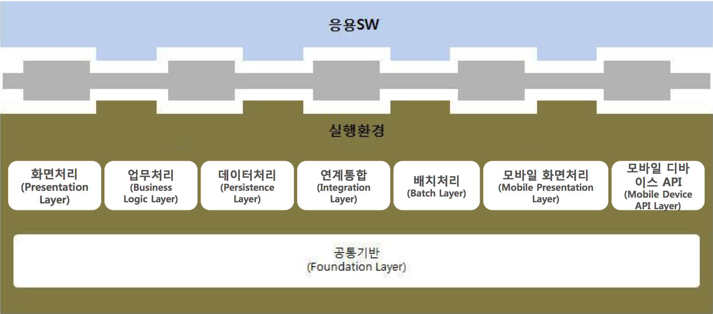
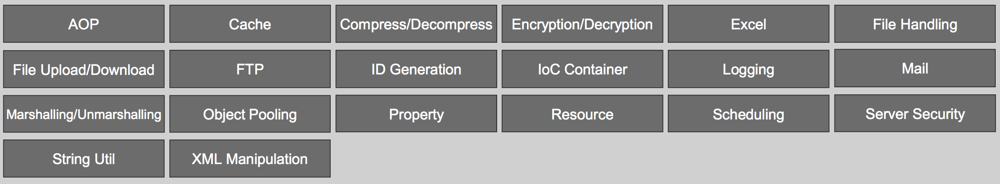
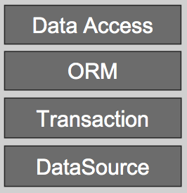
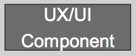

# 3. 오픈소스 소프트웨어 개발 환경

과거 소프트웨어 개발을 위한 환경을 구축하기 위해서는 고가의 유료툴이 필요했다. 유닉스 시스템부터 고가의 장비에 설치된 OS이었기 때문에 소프트웨어 개발을 위해서 개인이 접근하기 어려운 환경이었다. 하지만, 리누스 토발즈의 리눅스가 전파되고, 그 OS에서 촉발된 GNU 운동 때문에 gcc 등의 소프트웨어 개발을 무료로 사용 가능한 개발 환경을 개인도 쉽게 접근할 수 있게 되었다. 
웹 플랫폼이 등장하면서 자바와 함께 아파치 재단에서 키워진 많은 소프트웨어들은 서버, 라이브러리, 프레임워크, DB 등으로 범위를 넓혔고, 기업용 개발 환경도 이클립스의 등장과 함께 개발도구와 개발 환경은 비싼 비용을 들이지 않아도 된다라는 인식을 고착시키는데 일조했다.

이 문서에서는 오픈소스 소프트웨어를 통해서 쉽게 시작할 수 있는 개발환경에 대해서 설명하고, 소프트웨어 개발을 처음 접하는 사람도 어렵지 않게 개발 환경을 구축하는 방법을 제시한다.
모로 가도 서울만 가면 된다는 말처럼 목표한 성과물을 성취할 수 있도록 업계에서 다뤄지는 오픈소스 소프트웨어를 통한 개발 도구와 환경을 통해 원하는 소프트웨어를 만들 수 있기를 바라며 시작한다.

공공기관과 기업에서 가장 많이 사용하는 플랫폼인 자바 플랫폼을 기준으로 설명할 것이다. 아울러 개발자들의 OS가 윈도우즈, 맥, 리눅스 등 다양하기 때문에 서버로 많이 사용되는 리눅스 시스템에 맞춰 개발하는 것을 추천하고, 이를 위해서 가상머신을 통해서 개발하는 방법과 오픈소스 기반이 되는 git 버전관리 시스템을 기준으로 할 것이다.

다루게 될 오픈소스 제품들의 스택은 다음 그림과 같다.

사용할 오픈소스 소프트웨어의 목록이다.
1. VirtualBox
2. CentOS
3. MariaDB
4. Git
5. JDK
6. Tomcat
7. Maven
8. Jenkins
9. Sonarqube

이미 설치가 된 가상머신은 다음 주소에서 다운로드할 수 있게 했다.  
https://s3-ap-northeast-1.amazonaws.com/nsr/centos67.ova
(2G이상)

3.1 오픈소스 소프트웨어 개발 환경 개요

오픈소스 제품들이 개발될 때에 사용하는 기법들은 ALM(Application Lifecycle Management)와 잘 맞아 떨어진다.  ALM이라 함은 애플리케이션을 코딩과 테스트, 실행으로만 보지않고, 애플리케이션의 기획부터 출시, 그리고 고객의 피드백을 통한 유지보수까지 포함한 개발의 전과정을 관리하는 것이다.

3.1.1 오픈소스 ALM 도구

ALM을 위해서 가장 손쉽게 사용할 수 있는 방법은 ALM을 지원하는 서비스를 이용하는 것이다. GitHub이 대표적인 사이트이고, ALM을 위해서 필요한 기능을 제공한다.
ALM을 위해서 필요한 요소는 다음과 같다.
1. 소스 저장소
2. 자동 빌드 도구
3. 지속적인 통합
4. 이슈 트래커
5. 문서 관리
6. 커뮤니케이션

소스 저장소는 말그대로 애플리케이션의 프로그램 소스를 버전별로 관리할 수 있는 기능이다. RCS, CVS, Subversion, VSS, ClearCase와 같은 네트워크를 통해서 접근할 수 있는 버전 관리 시스템(Version Control System; VCS)이 있고, 네트워크가 끊겨도 버전관리가 가능한 분산 버전 관리 시스템(Distributed Version Control System; DVCS)가 있다. DVCS 제품으로는 git과 mercurial이 대표적이다.
직접 서버를 구축해서 활용할 수도 있고, GitHub(https://github.com), BitBucket(https://bitbucket.com), nforge(http://dev.naver.com/projects) 서비스를 무료로 이용할 수도 있다.

자동 빌드 도구는 컴파일, 테스트, 패키징 등 프로젝트를 자동으로 빌드해 주는 도구들이다. 가장 오래된 Make, 그리고 자바 기반의 ANT, Maven, Gradle 등이 있고, 자바스크립트에는 Grunt, Gulp, Brocolli 등의 제품들이 계속 나오고 있다.

지속적인 통합(Continuous Integration;CI)이란 프로젝트를 자동화 시켜주고, 그 결과를 대시보드로 쉽게 알 수 있는 도구들을 제공한다. Jenkins/Hudson가 대표적인 CI 도구이며 

오픈소스 개발을 꼼꼼하게 하기 위해서는 작업목록의 관리가 필요하다. 이를 위해서 이슈트래커(issue tracker)라는 것이 필요하고, 이를 지원하는 오픈소스 제품들이 다양하게 사용되고 있다. Yobi, Bugzilla, Trac, Redmine 같이 무료로 사용할 수 있는 제품들과 Jira같은 상용제품도 있지만, 오픈소스 프로젝트에서 사용한다면 Jira를 무료로 사용할 수 있다.
이슈와 관련된 문서들과 이미지를 첨부해서 관리하는 trello라고 하는 서비스도 참고할만 하다.

문서 관리는 프로젝트에 관련된 정보를 기록하는 도구이며, Wiki형식이 가장 많이 사용된다. 최근 GitHub을 중심으로 Markdown이라고 하는 형식으로 문서를 기록하는 경우가 많아지고 있다.

커뮤니케이션은 채팅, 메일링리스트 등을 통해서 프로젝트 관련자들이 쉽게 메시지를 주고받을 수 있도록하는 것이다. 채팅으로는 IRC가 인터넷 초기부터 사용되었으나 슬랙(Slack)이 등장하면서 많은 팀들이 슬랙에서 커뮤니케이션하는 것을 쉽게 볼 수 있다. 모바일 시대에 접어들면서 카카오톡이나 텔레그램 같이 모바일과 데스크탑을 함께 지원하는 메신저를 사용할 수도 있다. 메일링리스트는 구글 그룹스를 사용하는 것을 추천한다. 메일링리스트는 그룹메일 주소 하나로 구독하고 있는 모든 이들에게 메일을 보낼 수 있게 되어 있어서 프로젝트 참여자들의 모든 주소를 기억하지 않아도 된다.

3.1.2 Virtual Machine 이미지로 구성된 개발 환경 전체 구조

앞서 다운로드할 수 있게한 VirutalBox의 이미지에는 CentOS 6.7 OS가 설치되어 있고, 버전 관리 도구 Git 1.7.1, 데이터베이스 MariaDB 10.0.22, 자바 개발 킷 OpenJDK 1.7, 서블릿 컨테이너 Tomcat 7.0.63, 빌드 도구 Maven 3.3.3, 코드 품질 검사 sonarqube 4,5,6, 버전 관리 시스템을 포함한 이슈 트래커 yobi 0.8.2가 설치되어 있다.

제품들의 전체적인 스택은 다음 그림과 같다.

저장소에 있는 소스코드를 활용할 수 있는 구조이다. 모두 오픈소스 제품으로 구성되어 있으며, 프로젝트 기획부터 개발, 패키징, 품질 검사 등을 할 수 있다.

3.2 오픈소스 개발 도구

3.2.1 가상 머신

3.2.2 Git

Git 이란 파일의 변경 이력을 관리할 수 있는 버전관리시스템이다. CVS, SVN과 달리 네트워크가 끊긴 상황에서도 버전 기록(commit)이 가능하다.
리눅스 개발자로 유명한 리누스 토발즈가 개발했고, Git을 이용해서 만든 GitHub.com 서비스를 통해서 크게 확산되었다.
GitHub에서는 프로젝트별로 관리가 가능하다.
오픈소스처럼 공개된 프로젝트를 무료로 지원할 뿐만 아니라 사정에 따라 비밀 저장소를 무료로 사용하기 원한다면 BitBucket, NForge 등을 이용할 수도 있다.

 a. 다운로드, 설치  
http://git-scm.com 에서 Windows, Linux, MacOSX 다운로드 가능

 b. 사용자 설정  
코드를 변경한 사람의 이름과 이메일을 등록
git bash 실행
`git config --global user.email "kenu.heo@gmail.com"`
`git config --global user.name "kenu"`

 c. Git 시작하기
 `git init`
.git 폴더가 생기면서 이하 파일 버전관리 시작

 
 d. 관리 파일 추가하기  
 `git add filename`  
index에 추가. stage에 올라감.
 `git add *`
 `git add .`
하위 디렉토리 전부 추가

 `git status` 명령으로 상태 확인

* Git 파일 상태
  * Workspace
  * Stage
  * Repository
  * Remote Repository

 e. 버전 등록하기
 `git commit -m "메시지"`

 f. 변경 이력 보기
 `git log`
 `git log --oneline`

 g. 이전 버전으로 복원하기
 `git reset --hard`
 `git reset --hard versionhash`

 h. 파일 제외하기
 .gitignore 파일에 패턴 추가

Part 2 코드 공유  
 i. GitHub 회원가입  
 https://github.com

 j. GitHub 프로젝트 만들기  
 new Repository 메뉴 선택

 k. 프로젝트 PC로 가져오기  
 `git clone https://github.com/아이디/프로젝트명.git`
 `git clone https://github.com/그룹명/프로젝트명.git`

 l. 원격 코드 가져오기  
 `git pull`

 m. 원격에 코드 올리기  
 `git push`

참고  
* 누구나 쉽게 이해할 수 있는 Git 입문
http://backlogtool.com/git-guide/kr/

* Git 브랜치 배우기
http://learnbranch.urigit.com/

* A successful git branching model
http://dogfeet.github.io/articles/2011/a-successful-git-branching-model.html

3.2.3 JDK

3.2.4 이클립스

3.2.5 Maven

3.2.6 Jenkins

3.2.7 Sonarqube

3.3 eGov 표준프레임워크
## 실행환경
전자정부 표준프레임워크의 실행환경은 스프링 프레임워크를 중심으로 구성되어 있다. 개발환경이 개발의 편이성을 위해서 구성되어 있다면, 실행환경은 실제 서비스에 배포되는 프레임워크와 라이브러리로 구성되어 있다. 실행환경의 중심이 되는 스프링 프레임워크에 대한 이해가 있다면 애플리케이션 개발이 어렵지 않을 것이다. 실행환경 구성을 살펴보고 스프링 프레임워크의 기본을 다루어 보겠다.

### 실행환경 개요  
실행환경은 8가지 서비스 그룹으로 구성됩니다. 그림과 같이 공통기반 위에 화면처리, 업무처리, 데이터처리, 연계통합, 배치처리, 모바일 화면처리, 모바일 디바이스 API 레이어(Layer)들이 있다.   

<그림> 실행환경 구성  

#### 공통기반 (Foundation Layer)  
공통기반 레이어는 아래 그림과 같이 구성되어 있다. 20가지 기능별 컴포넌트들은 실행환경의 각 레이어에서 공통적으로 사용되는 기능을 제공한다.    
<그림> 공통기반 레이어 구성  

AOP, Cache, Compress/Decompress, Encryption/Decryption, Excel, File Handling, File Upload/Download, FTP, ID Generation, IoC Container, Logging, Mail, Marshalling/Unmarshalling, Object Pooling, Property, Resource, Scheduling, Server Security, String Uril, XML Manipulation 이상 20가지의 공통기능을 제공한다.
이 중에서 가장 주의깊게 봐야할 것이 IoC Container이다. 스프링의 핵심이고, 이것을 기준으로 표준프레임워크의 애플리케이션 패턴이 이루어집니다. 나머지 기능들도 각기 중요한 역할을 하기 때문에 후반에 하나씩 살펴보겠다.   

#### 화면처리 (Presentation Layer)  
화면처리 레이어는 MVC(Model-View-Controller) 패턴에서 View에 해당한다. 화면처리 레이어의 구성은 다음과 같다.  
<그림> 화면처리 레이어 구성  
  

Spring MVC, Internationalization, Ajax Support, Security, UI Adaptor 이상 5가지 기능을 제공한다.  
MVC 패턴의 프레임워크는 스프링 MVC, 스트럿츠(Struts), 웹워크(Webwork) 등이 있지만, 표준프레임워크에서는 스프링 MVC를 채택하였다.  
국제화(Internationalization) 기능은 다국어를 처리하는 방법이다. 스프링 MVC의 LocaleResolver를 이용한다. 브라우저 헤더, 세션, 쿠키 등에 있는 언어 정보를 이용해서 해당 언어로 페이지를 보여주는 기능이다.  
Ajax 지원은 AjaxTags 라이브러리를 이용한다. Ajax를 이용해 자주 사용되는 기능을 custom tag형태로 제공한다.  
인증, 권한 같은 일반적인(통상적인) 개념의 Security 서비스는 Spring Security를 활용한 공통기반 레이어에
서 제공한다. 화면처리 레이어의 Security 서비스는 입력값 유효성 검증 기능을 제공한다. 스프링과 연결되는 자카르타 커먼스 밸리데이터(Jakarta Commons Validator)를 이용한다.  
UI 어댑터는 표준프레임워크와 RIA(Rich Internet Application) 솔루션을 연결하기 위한 기능이다. 마이플랫폼 등의 상용 솔루션과 연결을 지원하는 기능이다.  
  

#### 업무처리 (Business Logic Layer)  
업무처리 레이어는 업무 프로그램의 업무 로직을 담당하는 레이어로서, 업무 흐름 제어, 에러 처리 등의 기능을 제공한다.  
<그림> 업무처리 레이어 구성  
  

업무처리 레이어는 Spring Web Flow, Spring 이상 2가지 오픈소스를 사용한다.  
프로세스 제어(Process Control)을 담당하는 웹 플로우는 페이지 흐름(flow)의 정의와 수행을 처리한다.  
에러 처리(Exception Handling)는 표준프레임워크 기반의 시스템 개발시 Exception에 따라서 특정 로직을 실행하여 Exception에 따라 적절한 대응을 할 수 있다.  

#### 데이터처리 (Persistence Layer)  
데이터처리 레이어는 데이터를 다루는 역할을 전담하며, 데이터베이스에 대한 연결 및 영속성 처리, 선언적인 트랜잭션 관리를 제공한다. 데이터처리 레이어의 구성은 다음과 같다.  

<그림> 데이터처리 레이어 구성  
  

데이터소스(DataSource)와 트랜잭션(Transaction)은 스프링을 사용한다.  
데이터 접근(Data Access)는 iBatis를 사용하고 있으며, SQL Mapper를 통해서 XML로 정의된 SQL을 활용한다.  
ORM(Object-Relational Mapping)은 하이버네이트(Hibernate)를 사용하고 있다. 하이버네이트는 자바 객체와 관계형 데이터 모델 간의 매핑을 위한 도구이며, 자동 생성된 쿼리 서비스를 지원하는 강력한 고성능의 퍼시스턴스 프레임워크이다.

#### 연계통합 (Integration Layer)  
연계통합 레이어는 다른 시스템과 데이터 교환을 지원하는 역할을 한다. 연계통합 레이어의 구성은 다음과 같다.  

<그림> 연계통합 레이어 구성  
  

Naming Service, Integration Service, Web Service 등 총 3개 서비스를 제공한다.  
네이밍 서비스(Naming Service)는 스프링을 이용한다.  
인테그레이션 서비스(Integration Service)는 표준프레임워크 기반의 시스템이 다른 시스템과의 연계를 위해 사용하는 Interface의 표준을 정의한 것입이다.  
웹 서비스(Web Service)는 아파치 CXF를 사용한다. 공개되어 있는 웹 서비스를 호출하고, 처리 결과를 돌려줍니다. 개발한 업무 모듈을 웹 서비스로 공개할 수 있도록 프록시(Proxy) 등을 제공하고, 완성된 웹 서비스로 공개한다.

#### 배치처리 (Batch Layer)  

<그림> 배치처리 레이어 구성  
  

#### 모바일 화면처리 (Mobile Presentation Layer)  

<그림> 모바일 화면처리 레이어 구성  
  

#### 모바일 디바이스 API (Mobile Device API Layer)  

<그림> 모바일 디바이스 API 레이어 구성  
  

### 스프링 프레임워크  
스프링 프레임워크는 2004년 로드 존스의 development J2EE without EJB 라는 책이 시발점이 되었다. 무거운 EJB 없이도, J2EE 스택과 연계된 개발이 가능하다는 것이었고, 당시에는 경량(Light Weight) 프레임워크라는 이름이 함께 따라 다녔다. 스프링 프레임워크의 핵심 개념에는 비즈니스 로직의 POJO(Plain Old Java Object)를 중심으로 제어의 역전(Inversion of Control;IoC)/의존성 주입(Dependency Injection;DI), AOP(Aspect Oriented Program), 서비스 추상화(Portable Service Abstraction; PSA), 이상 세 가지 컨셉으로 구성되어 있다.  

## 모바일 표준프레임워크  
스마트폰의 등장과 생활 속에서 강력한 파급효과를 보이면서, 업무를 모바일 환경에서 적용하려는 노력이 많아지고 있다. 스마트폰에 있는 웹브라우저는 가장 발전이 빠른 웹킷엔진을 사용하고 있다. 품질이 좋은 오픈소스가 많이 활용되기 때문이다. 

